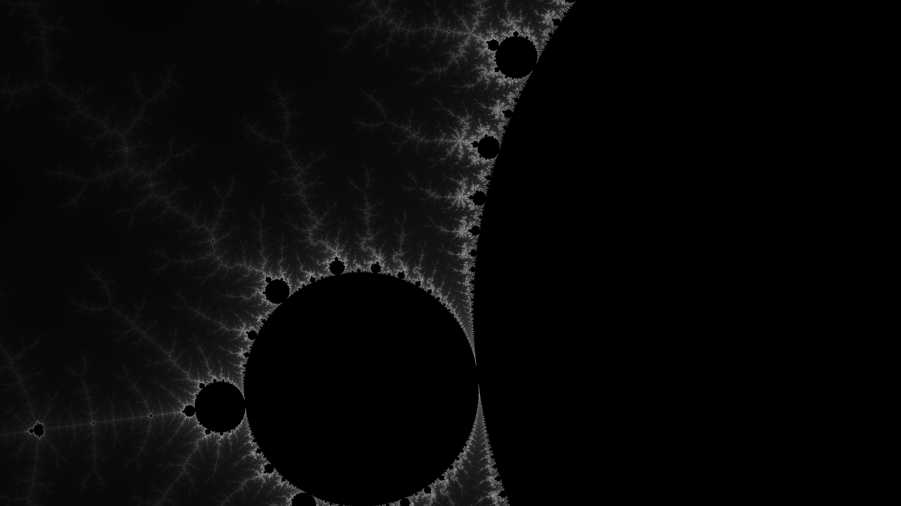

# Mandelbrot Viewer
Interactive viewer for mandelbrot sets

## Features
* Zoom in/out infinitely
* Pan around
* Cyclical colour map
* View should render in real-time. i.e. we shouldn't need to wait until a pixel is completely computed before rendering it.
* User should be able to specify the parameters of the julia set to render.

# Related
https://github.com/rosslh/mandelbrot.site - written in rust too

#### Cool example of output

